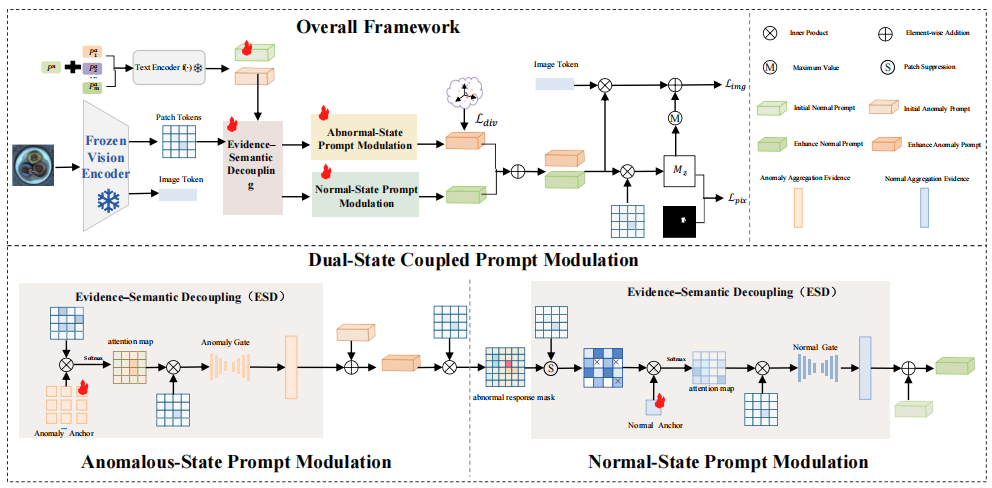
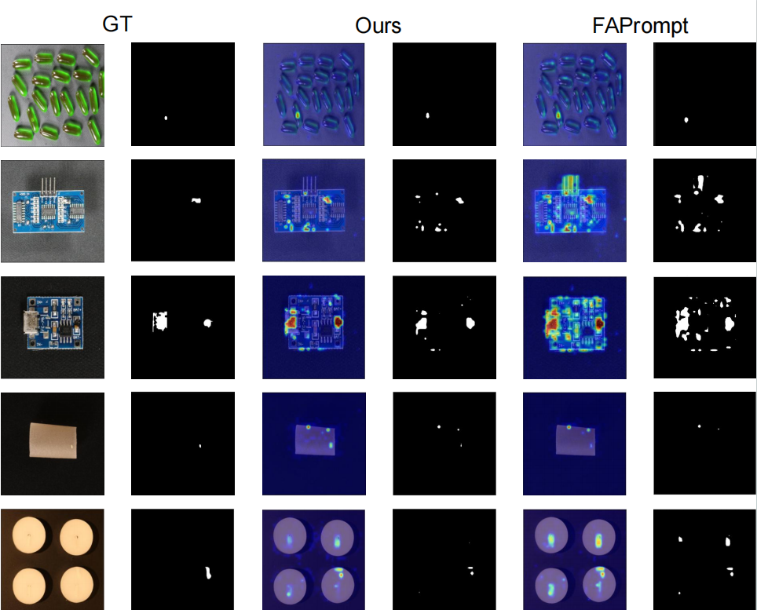
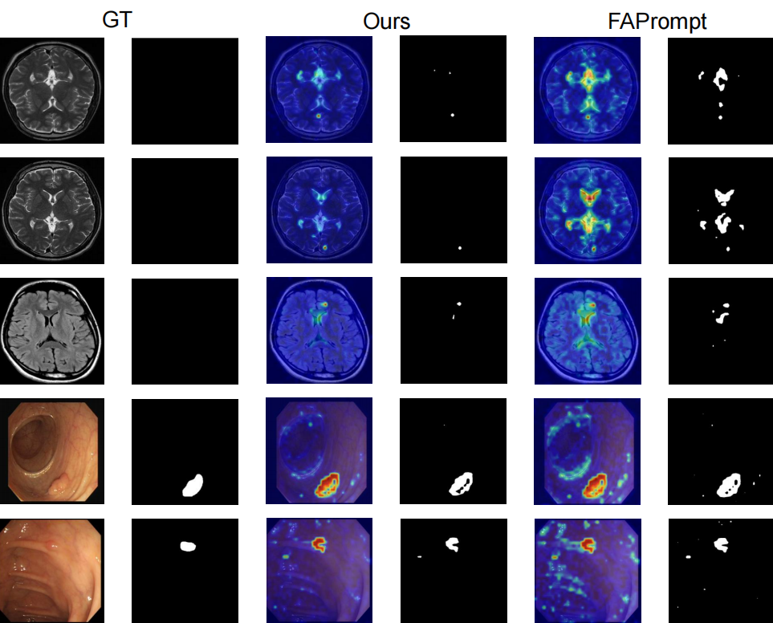

# DSE-Prompt

Official PyTorch implementation of:

**DSE-Prompt: Dual-State Evidence-Decoupled Prompt Learning for Zero-Shot Anomaly Detection**

---

## 1. Project Introduction

### Abstract

Although vision–language-model-based zero-shot anomaly detection has advanced substantially in cross-category settings, existing prompt modulation paradigms remain limited in two respects. First, during sample-adaptive prompt modulation, anomaly prompts simultaneously perform local evidence retrieval, semantic discrimination, and pixel-level localization. This role coupling biases them toward high-response regions, creating a self-confirming loop in which the discriminator also serves as the evidence selector. Second, normal prompts usually act only as static references to normality in the final similarity-based competition, restricting the use of stable background cues during evidence absorption.

To address these limitations, we propose Dual-State Evidence-Decoupled Prompt Learning (DSE-Prompt). DSE-Prompt constructs an independent visual evidence layer in which learnable evidence anchors aggregate local evidence, while a gated residual mechanism selectively injects candidate evidence into prompts, thereby decoupling anomaly semantic representation from low-level evidence retrieval. Furthermore, normal prompts are incorporated into evidence absorption, and normal-evidence masks derived from the original anomaly responses stabilize the normal state and reinforce the benefits of evidence–semantic decoupling.

Experimental results demonstrate that DSE-Prompt achieves more stable overall performance across image-level anomaly discrimination, pixel-level anomaly localization, and cross-dataset evaluation.

### Method Framework

<p align="center">
  
</p>

<p align="center">
  <b>Overall framework of DSE-Prompt.</b>
</p>

The framework consists of vision–language encoding, Evidence–Semantic Decoupling, and normal–anomalous Dual-State Coupling. Learnable evidence anchors independently aggregate local visual evidence, while state-specific evidence-admission rules selectively enhance normal and anomaly prompts for image-level anomaly discrimination and pixel-level anomaly localization.

---

## 2. Environment

### Environment Installation

The environment configuration of DSE-Prompt is consistent with that of [FAPrompt](https://github.com/mala-lab/FAPrompt).

Please follow the environment and dependency installation instructions provided in the official FAPrompt repository.

### Data Preparation

#### 1. Dataset Download

DSE-Prompt is trained using the MVTec AD test split as auxiliary source-domain anomaly data and is directly evaluated on unseen industrial and medical datasets without target-domain training or fine-tuning.

| Usage                | Domain     | Dataset       | Download                                                                                                   |
| -------------------- | ---------- | ------------- | ---------------------------------------------------------------------------------------------------------- |
| Auxiliary training   | Industrial | MVTec AD      | [Download](https://www.mvtec.com/research-teaching/datasets/mvtec-ad)                                      |
| Zero-shot evaluation | Industrial | DTD-Synthetic | [Download](https://drive.google.com/drive/folders/10OyPzvI3H6llCZBxKxFlKWt1Pw1tkMK1)                       |
| Zero-shot evaluation | Industrial | MPDD          | [Download](https://github.com/stepanje/MPDD)                                                               |
| Zero-shot evaluation | Industrial | VisA          | [Download](https://github.com/amazon-science/spot-diff)                                                    |
| Zero-shot evaluation | Industrial | DAGM          | [Download](https://www.kaggle.com/datasets/mhskjelvareid/dagm-2007-competition-dataset-optical-inspection) |
| Zero-shot evaluation | Medical    | BrainMRI      | [Download](https://www.kaggle.com/datasets/navoneel/brain-mri-images-for-brain-tumor-detection)            |
| Zero-shot evaluation | Medical    | Br35H         | [Download](https://www.kaggle.com/datasets/ahmedhamada0/brain-tumor-detection)                             |
| Zero-shot evaluation | Medical    | CVC-ColonDB   | [Download](https://figshare.com/articles/figure/Polyp_DataSet_zip/21221579)                                |
| Zero-shot evaluation | Medical    | CVC-ClinicDB  | [Download](https://figshare.com/articles/figure/Polyp_DataSet_zip/21221579)                                |
| Zero-shot evaluation | Medical    | Kvasir-SEG    | [Download](https://figshare.com/articles/figure/Polyp_DataSet_zip/21221579)                                |
| Zero-shot evaluation | Medical    | ISIC          | [Download](https://drive.google.com/file/d/1UeuKgF1QYfT1jTlYHjxKB3tRjrFHfFDR/view)                         |
| Zero-shot evaluation | Medical    | TN3K          | [Download](https://github.com/haifangong/TRFE-Net-for-thyroid-nodule-segmentation)                         |

#### 2. Dataset Organization

The downloaded datasets can be organized as follows:

```text
data/
├── mvtec_anomaly_detection/
├── dtd_synthetic/
├── mpdd/
├── visa/
├── dagm/
├── brainmri/
├── br35h/
├── cvc_colondb/
├── cvc_clinicdb/
├── kvasir_seg/
├── isic/
└── tn3k/
```

The original internal structure of each dataset should be retained. A `meta.json` annotation file should be generated for each dataset using the format adopted by [AnomalyCLIP](https://github.com/zqhang/AnomalyCLIP).

An example dataset root is shown below:

```text
dataset_root/
├── meta.json
├── category_1/
│   ├── ground_truth/
│   └── test/
├── category_2/
│   ├── ground_truth/
│   └── test/
└── ...
```

The dataset root is specified through `--train_data_path` during training and `--data_path` during inference.

---

## 3. Training and Inference

### Training

The training command is:

```bash
bash train.sh
```

### Inference

The inference command is:

```bash
bash test.sh
```

---

## 4. Results

### Quantitative Results

The best and second-best results are marked in **bold** and <u>underlined</u>, respectively.

#### 1. Image-Level Anomaly Discrimination

Image-level results are reported as **(I-AUROC, I-AP)**.

| Data Type  | Dataset  | CLIP         | WinCLIP      | APRIL-GAN    | CoOp         | CoCoOp       | AnomalyCLIP  | FiLo                 | FAPrompt                   | DSE-Prompt                 |
| ---------- | -------- | ------------ | ------------ | ------------ | ------------ | ------------ | ------------ | -------------------- | -------------------------- | -------------------------- |
| Industrial | DTD      | (71.6, 85.7) | (93.2, 92.6) | (86.4, 95.0) | (83.1, 91.9) | (84.1, 92.9) | (93.5, 97.0) | (94.7, 98.0)         | (<u>96.2</u>, <u>98.1</u>) | (**96.6**, **98.6**)       |
| Industrial | MPDD     | (54.3, 65.4) | (63.6, 69.9) | (73.0, 80.2) | (55.1, 64.2) | (61.0, 69.1) | (77.0, 82.0) | (74.4, 76.9)         | (<u>79.7</u>, <u>83.3</u>) | (**80.7**, **83.8**)       |
| Industrial | VisA     | (66.4, 71.4) | (78.8, 81.4) | (78.0, 81.4) | (62.8, 68.1) | (78.1, 82.3) | (82.1, 84.6) | (**83.9**, **87.3**) | (<u>83.8</u>, 86.0)        | (<u>83.8</u>, <u>86.5</u>) |
| Industrial | DAGM     | (79.6, 59.0) | (91.8, 79.5) | (94.4, 83.8) | (87.5, 74.6) | (96.3, 85.5) | (97.5, 92.3) | (96.6, 90.4)         | (<u>98.4</u>, <u>95.3</u>) | (**98.5**, **95.8**)       |
| Medical    | BrainMRI | (73.9, 81.7) | (86.6, 91.5) | (89.3, 90.9) | (61.3, 44.9) | (78.2, 86.7) | (90.3, 92.2) | (94.5, <u>94.9</u>)  | (<u>95.2</u>, 94.4)        | (**95.8**, **96.5**)       |
| Medical    | Br35H    | (78.4, 78.8) | (80.5, 82.2) | (93.1, 92.9) | (86.0, 87.5) | (85.7, 89.1) | (94.6, 94.7) | (**97.7**, 96.8)     | (97.1, <u>96.9</u>)        | (<u>97.5</u>, **97.4**)    |

#### 2. Pixel-Level Anomaly Localization

Pixel-level results are reported as **(P-AUROC, PRO)**.

| Data Type  | Dataset      | CLIP         | WinCLIP      | APRIL-GAN    | CoOp         | CoCoOp       | AnomalyCLIP         | FiLo                 | FAPrompt                   | DSE-Prompt                 |
| ---------- | ------------ | ------------ | ------------ | ------------ | ------------ | ------------ | ------------------- | -------------------- | -------------------------- | -------------------------- |
| Industrial | DTD          | (33.9, 12.5) | (83.9, 57.8) | (95.3, 86.9) | (55.8, 36.0) | (93.7, 83.7) | (97.9, <u>92.3</u>) | (<u>98.1</u>, 88.6)  | (**98.3**, **92.6**)       | (**98.3**, **92.6**)       |
| Industrial | MPDD         | (62.1, 33.0) | (76.4, 48.9) | (94.1, 83.2) | (15.4, 2.3)  | (95.2, 84.2) | (**96.5**, 87.0)    | (95.7, 84.7)         | (<u>96.3</u>, **87.9**)    | (<u>96.3</u>, <u>87.6</u>) |
| Industrial | VisA         | (46.6, 14.8) | (79.6, 56.8) | (94.2, 86.8) | (24.1, 3.8)  | (93.6, 86.7) | (95.5, 87.0)        | (**95.9**, 85.4)     | (<u>95.7</u>, **87.7**)    | (<u>95.7</u>, <u>87.2</u>) |
| Industrial | DAGM         | (28.2, 2.9)  | (87.6, 65.7) | (82.4, 66.2) | (17.5, 2.1)  | (82.8, 75.1) | (95.6, 91.0)        | (96.8, 90.6)         | (<u>98.2</u>, <u>95.3</u>) | (**98.3**, **95.4**)       |
| Medical    | CVC-ColonDB  | (49.5, 15.8) | (70.3, 32.5) | (78.4, 64.6) | (40.5, 2.6)  | (79.1, 69.7) | (81.9, 71.3)        | (81.5, 63.9)         | (<u>84.1</u>, <u>73.8</u>) | (**85.8**, **75.5**)       |
| Medical    | CVC-ClinicDB | (47.5, 18.9) | (51.2, 13.8) | (80.5, 60.7) | (34.8, 2.4)  | (83.4, 68.8) | (82.9, 67.8)        | (<u>84.6</u>, 62.3)  | (84.2, <u>69.7</u>)        | (**85.2**, **71.8**)       |
| Medical    | Kvasir       | (44.6, 17.7) | (69.7, 24.5) | (75.0, 36.2) | (44.1, 3.5)  | (79.1, 38.6) | (78.9, 45.6)        | (**85.0**, **53.2**) | (80.4, 48.0)               | (<u>82.4</u>, <u>50.1</u>) |
| Medical    | ISIC         | (33.1, 5.8)  | (83.3, 55.1) | (89.4, 77.2) | (51.7, 15.9) | (81.9, 68.9) | (89.7, 78.4)        | (**91.1**, 80.1)     | (<u>90.9</u>, <u>81.6</u>) | (**91.1**, **82.7**)       |
| Medical    | TN3K         | (42.3, 7.3)  | (70.7, 39.8) | (73.6, 37.8) | (34.0, 9.5)  | (72.4, 41.0) | (81.5, 50.4)        | (79.8, 48.5)         | (<u>84.7</u>, <u>54.6</u>) | (**85.1**, **55.1**)       |

### Qualitative Results

Each row presents the input image, pixel-level ground-truth mask, and the anomaly heatmap and binary prediction generated by DSE-Prompt and FAPrompt.

#### 1. Industrial Anomaly Detection

<p align="center">
  
</p>

<p align="center">
  <b>Qualitative comparison on industrial anomaly detection datasets.</b>
</p>

DSE-Prompt produces more concentrated anomaly responses around true defect regions and reduces diffuse responses over repetitive textures and structured industrial backgrounds.

#### 2. Medical Anomaly Detection

<p align="center">
  
</p>

<p align="center">
  <b>Qualitative comparison on medical anomaly detection datasets.</b>
</p>

DSE-Prompt suppresses irrelevant responses in normal tissues and background regions while concentrating anomaly activations around lesions.

---

## 5. License

### License

This project is released under the [MIT License](LICENSE).

### Acknowledgements

This implementation is developed based on the following open-source projects:

* [FAPrompt](https://github.com/mala-lab/FAPrompt): Fine-grained Abnormality Prompt Learning for Zero-Shot Anomaly Detection.
* [AnomalyCLIP](https://github.com/zqhang/AnomalyCLIP): Object-agnostic Prompt Learning for Zero-Shot Anomaly Detection.

We sincerely thank the authors for making their code publicly available.
